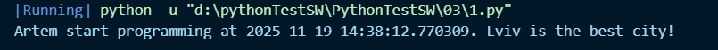
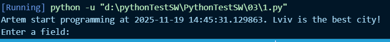

# Звіт до роботи
## Тема: _згідно теми_
### Мета роботи: _згідно теми_

---
### Виконання роботи
* Результати виконання завдання *1...N*;
   Запустив базову програму на пайтон + завдяки ШІ протестував завдання яке він мені показав
 

---
### Висновок:
> у висновку потрібно відповісти на запитання:

- :question: Що зроблено в роботі; Виконання базового завдання з опису завдання + з ШІ
- :question: Чи досягнуто мети роботи; Так
- :question: Які нові знання отримано;
- :question: Чи вдалось відповісти на всі питання задані в ході роботи; Так
- :question: Чи вдалося виконати всі завдання; Так
- :question: Чи виникли складності у виконанні завдання; Ні
- :question: Чи подобається такий формат здачі роботи (Feedback); Супер
- :question: Побажання для покращення (Suggestions); Поки нема

---