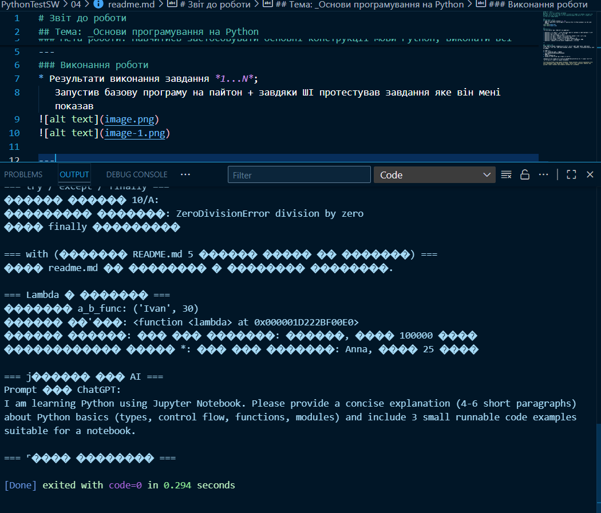

# Звіт до роботи
## Тема: _Основи програмування на Python
### Мета роботи: Навчитись застосовувати основні конструкції мови Python, виконати всі приклади та з використанням AI створити власні приклади які демонструють особливості кодових конструкцій Pyhton

---
### Виконання роботи
* Результати виконання завдання *1...N*;

---
### Висновок:
> у висновку потрібно відповісти на запитання:

- :question: Що зроблено в роботі; Виконання базового завдання з опису завдання + з ШІ
- :question: Чи досягнуто мети роботи; Так
- :question: Які нові знання отримано;
- :question: Чи вдалось відповісти на всі питання задані в ході роботи; Так
- :question: Чи вдалося виконати всі завдання; Так
- :question: Чи виникли складності у виконанні завдання; Ні
- :question: Чи подобається такий формат здачі роботи (Feedback); Супер
- :question: Побажання для покращення (Suggestions); Поки нема

---

### Приклади коду
{ Додано/оновлено секцію з описом прикладів файлу та очікуваним виводом }

### Опис файлу examples.py
- Файл: examples.py — містить виконувані приклади для тем:
  - Типи даних: str, int, float, list, dict, tuple, set
  - Вбудовані константи та ключові слова (частково)
  - Приклади вбудованих функцій (abs, round, len)
  - Цикли: for, while, enumerate, приклад else в циклі
  - Розгалуження: if / elif / else та тернарний вираз
  - Обробка помилок: try / except / finally
  - Контекст-менеджер: with (читання README.md)
  - Lambda: приклади та використання
- Як запустити:
  1. Відкрийте термінал і перейдіть в папку:
     cd d:\pythonTestSW\PythonTestSW\04
  2. Запустіть:
     python examples.py
  3. Скопіюйте вивід в звіт або зробіть скриншоти.

### Приклад очікуваного виводу (фрагмент)
- Блоки виводу будуть розділені заголовками, наприклад:
  - "=== Типи даних ===" з переліком змінних
  - "=== Вбудовані функції ===" з результатами abs(), round(), len()
  - "=== try / except / finally ===" — якщо помилка ділення, виведе її тип і повідомлення
  - "=== Lambda і функції ===" — демонстрація викликів

### Як вставити результати в Jupyter Notebook
- Запустіть examples.py локально і скопіюйте консольний вивід у Markdown- або Code-ячейку ноутбука.
- Або створіть нову code-ячейку і вставте потрібні фрагменти коду без змін — вони будуть виконуватись в ноутбуці.

Підказка для AI (скопіюйте і вставте у ChatGPT/інший помічник для отримання текстової роз'яснювальної секції для Jupyter Notebook):
```
I am learning Python using Jupyter Notebook. Please provide a concise explanation (4-6 short paragraphs) about Python basics (types, control flow, functions, modules) and include 3 small runnable code examples suitable for a notebook.
```